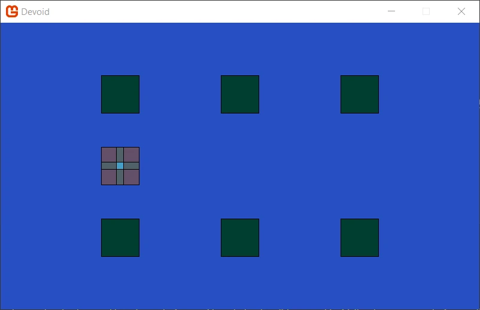

# Devoid


## Setup
On Windows: 
1. install [Visual Studio](https://visualstudio.microsoft.com/vs/)

On Linux: 
1. install [.NET](https://dotnet.microsoft.com/en-us/download)
2. install [Visual Studio Code](https://code.visualstudio.com/?wt.mc_id=vscom_downloads) (Optional)


## Run the game
The command to run the program without Visual Studio.
```
dotnet run --project Devoid
```

For Windows, you can use the batch file to run the game.
```
.\run.bat
```

For Linux, you can use the shell script to run the game.
```
./run.sh
```
